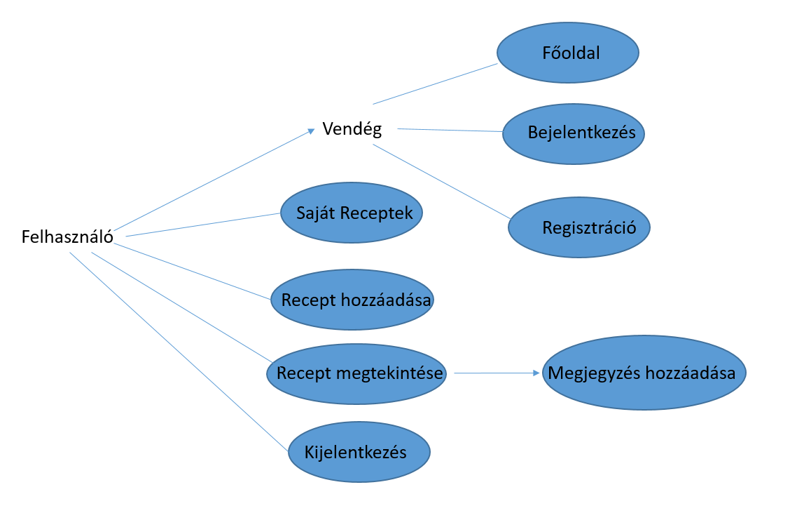

# Dokumentáció

## Követelményanalízis

Feladat: 
Első beadandóként  egy kis  webes alkalmazás elkészítése a cél szerveroldali technológiák segítségével. 
A feladatnak mininálisan tartalmaznia kell:

- legalább két modellt, egy-sok kapcsolatban
- legalább 1 űrlapot
- legalább 1 listázó oldalt
- legyen lehetőség új felvételére
- legyen lehetőség meglévő szerkesztésére
- legyen lehetőség meglévő törlésére
- legyenek benne csak hitelesítés után elérhető funkciók
- perzisztálás fájlba történjen
- közzététel Herokun

Választott feladat: Receptek és hozzávalók

Funkcionális elvárások:
- A felhaszáló recepteket szeretne tároli, erre szolgál az új recept hozzáadása.
- A felvett recepteket meg kell jeleníteni, későbbi olvasásra.
- A recepteket meg lehessen tekinteni és módosításokat lehessen hozzáírni, hogy minél jobb legyen.
- A recepteket lehessen törölni is.
- Bejelentkezés után lehessen hozzáférni a receptekhez.
- A főoldalon legyen rövid tájékoztató.

Nem funkcionális elvárások:
- Felhasználóbarát elrendezés
- Gyors működés
- Biztonságos működés: jelszavak tárolása

Használatieset-modell:

Szerepkörök:
- vendég: a főoldalhoz, a regisztrációhoz, és a bejelentkezés oldalakhoz fér hozzá, de recepteket megtekinteni és rögzíteni nem tud
- felhasználó: a vendég szerepkörén túl recepteket tud hozzáadni, módosítani és törölni

Használati eset diagram:

Folyamat menete:

Főoldal->Bejelenkezés->Saját receptek->Új recept hozzáadása

##Tervezés

Architektúra terv:

Oldaltérkép:

Publikus:
- Főoldal
- Regisztráció
- Bejelentkezés

Felhasználó:
- Főoldal
- Bejelentkezés/Kilépés
- Receptek: Új recept hozzáadása/törlése, Recept megtekintése/módosítás hozzáfűzése

Végpontok:

- get/ : főoldal
- get/login : bejelentkező oldal
- post/login : bejelentkezési adatok bevitele
- get/signup : regisztrációs oldal
- post/signup : regisztrációs adatok elküldése
- get/list : receptek megjelenítése
- get/new : új recept felvétele
- post/new : recept adatainak felküldése
- get/:id : recept adatai
- post/:id/comment : módosítás hozzáadása
- get/delete/:id : recept törlése

Adatmodell:

##Implementáció

Fejlesztői környezet: Cloud9

Könyvtárstruktúrában lévő mappák funkiójának bemutatása:

- recipebeada: főkönyvtár
- recipebeada/controllers : végpontok definiálása és műveleteik
- recipebeada/models : adatmodellek és tesztelés
- recipebeada/views/login : regisztráció és bejelentkezés
- recipebeada/views/recipes : receptek hozzáadása és megtekintése

##Tesztelés

Tesztelési környezet: Cloud9

Egységteszt: mocha, chai
- User tesztelése : (user.test.js) Felhasználó létrehozásának és azonosításának tesztje.
- Eredmény: passing

Funkcionális teszt: Selenium IDE
Tesztesetek:
- [Bejelentkezés, majd új recept felvétele és kijelentkezés.](https://github.com/dies45/recipebeada/blob/master/tests/recipebtest.html)
- [Bejelentkezés, megjegyzés felvétele és kilépés.](https://github.com/dies45/recipebeada/blob/master/tests/recipebtestmegj.html)
- [Bejelentkezés, egy recept törlése és kilépés.](https://github.com/dies45/recipebeada/blob/master/tests/recipebtesttorles.html)
- Eredmények: passed

##Felhasználói dokumentáció

A futtatáshoz ajánlott minimális követelmény: 

512MB RAM, 1GB HDD, webböngésző

A program használata:

Közzétéve: [http://recipebeada.herokuapp.com/](http://recipebeada.herokuapp.com/) oldalon.

Kezdetben a főoldalt láthatjuk, aminek a jobb felső sarkában két link található. Ha még nem regisztráltunk, akkor kattintsunk a regisztráció fülre, ha már regisztráltunk, akkor a bejelentkezésre. A regisztrációs oldalon meg kell adnunk adatainkat, majd a megerősít gombra kattintva regisztrálhatunk. Bejelentkezéskor adjuk meg a regisztrációkor begépelt felhasználónevünket és jelszavunkat, ezután kattintsunk a Submit gombra. Sikeres bejelentkezés után recepteket vehetünk fel a gyűjteményhez az Új recept hozzáadása gombra kattintva. Itt töltsük ki a megfelelő mezőket és kattintsunk a Submit gombra. Ezután megjelenik az újonnan felvett recept. Ezt megtekinthetjük a Megtekint gombra kattintva. Megjelenik a recept leírása, amihez megjegyzéseket fűzhetünk hozzá. A megjegyzés begépelése után kattintsunk a Submit gombra, amivel sikeresen felvettük a megjegyzésünket. A Recept oszlopba láthatjuk, hogy hány megjegyzést vettünk fel a recepthez. Ha végeztünk, akkor kattintsunk a Kilépés fülre, amivel sikeresen kijelentkezhetünk. 
